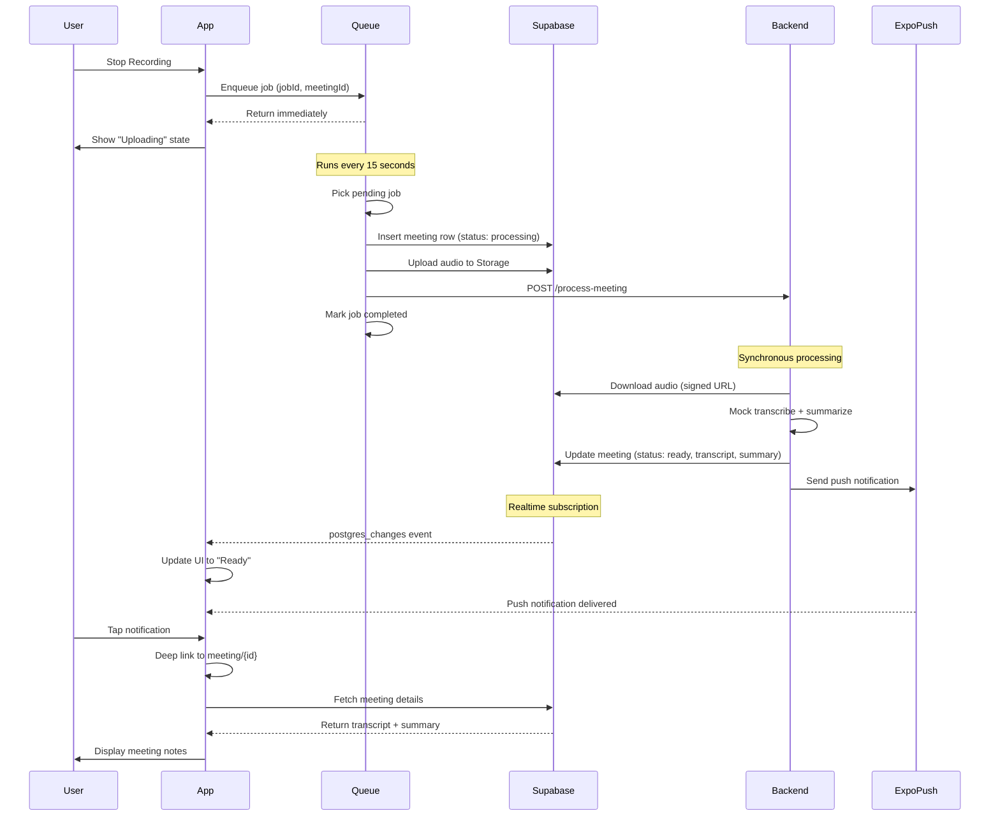

# AI Meeting Assistant – Architecture

This document describes the system architecture, design decisions, and trade-offs for the AI Meeting Assistant mobile application.

## 1. High-Level Overview

The system consists of four primary components:

```
┌─────────────────┐
│  Mobile App     │  Expo React Native
│  (Expo SDK 54)  │  - Background audio recording
│                 │  - Client-side upload queue
│                 │  - Supabase Auth + Storage
│                 │  - Realtime subscriptions
│                 │  - Push notifications
└────────┬────────┘
         │
         ├─────────────┐
         │             │
         ▼             ▼
┌─────────────┐  ┌──────────────┐
│  Supabase   │  │  Backend     │  FastAPI (Python)
│  Platform   │  │  (FastAPI)   │  - /process-meeting endpoint
│             │  │              │  - Mock transcription/summary
│ • Auth      │  │              │  - Database updates
│ • Postgres  │  │              │  - Push notification trigger
│ • Storage   │  └──────┬───────┘
│ • Realtime  │         │
└─────────────┘         │
                        ▼
                ┌────────────────┐
                │  Expo Push     │
                │  Service       │  - FCM (Android)
                │                │  - APNs (iOS)
                └────────────────┘
```

**Mobile App**: Records audio with background support, manages upload queue with retry logic, handles authentication and push notifications.

**Supabase**: Provides authentication (email/password), PostgreSQL database with Row Level Security (RLS), file storage for audio files, and Realtime subscriptions for instant status updates.

**Backend**: FastAPI server that downloads audio, generates mock transcripts/summaries, updates database, and sends push notifications.

**Expo Push Service**: Routes push notifications to FCM (Android) and APNs (iOS) based on device tokens.

## 2. Recording Flow (Background Support)

The app uses `expo-av` for native audio recording with background continuation.

### Configuration

**iOS:**
- Custom config plugin adds `audio` to `UIBackgroundModes` in `Info.plist`
- `AVAudioSession` configured with `staysActiveInBackground: true`
- `NSMicrophoneUsageDescription` required for microphone permission
- Audio continues recording when app is backgrounded or screen locked

**Android:**
- Custom config plugin adds `RECORD_AUDIO` permission
- Foreground service with `FOREGROUND_SERVICE_MICROPHONE` permission (Android 14+)
- Notification channel configured for foreground service visibility
- Service prevents system from killing the recording process

### Recording Implementation

**Service Layer** (`/services/recordingService.ts`):
- Wraps `expo-av` with clean start/stop API
- Configures audio mode for background operation
- Records in AAC format at 44.1kHz, 128kbps
- Exports `.m4a` files for broad compatibility
- Provides duration tracking and permission handling

**State Management**:
- Strict state machine: `idle | recording | uploading | processing`
- Guards prevent impossible state transitions (e.g., stopping while idle)
- Record button disabled during upload/processing states

**Dev Build Requirement**: Background audio recording requires prebuild to apply native configurations. Expo Go does not support background audio or foreground services.

## 3. Upload + Processing Flow

When the user stops recording, the audio file enters a persistent queue system that ensures reliable delivery.

### Queue Architecture

**Storage**: AsyncStorage with atomic writes to `@queue/jobs` key
- Jobs persist across app restarts and survive crashes
- Crash recovery automatically resets stuck jobs (status: `running` → `pending`)
- 24-hour cleanup removes completed jobs

**Retry Strategy**: Exponential backoff prevents overwhelming the backend during outages
- Attempt 1: Retry after 1 second
- Attempt 2: Retry after 2 seconds
- Attempt 3: Retry after 4 seconds
- Attempt 4: Retry after 8 seconds
- Attempt 5: Retry after 16 seconds
- After 5 failures: Job marked as "failed", manual retry available

**Concurrency**: Single global lock prevents race conditions
- Only one job processes at a time
- Queue runs every 15 seconds (automatic polling)
- Queue triggers on app foreground transition

### Upload Process (Per Job)

Each queued job executes three sequential steps:

1. **Create Meeting Row**: Insert row in Supabase `meetings` table with status `processing`
   - Stores user ID, audio path, duration, timestamp
   - RLS policies ensure users only access their own meetings

2. **Upload Audio**: Upload `.m4a` file to Supabase Storage
   - Path structure: `{user_id}/{meeting_id}.m4a`
   - Pre-upload size validation (50MB limit on free tier)
   - RLS policies restrict access to file owner only

3. **Request Backend Processing**: HTTP POST to `/process-meeting`
   - Sends signed audio URL (time-limited access)
   - Sends meeting ID and push token
   - Fire-and-forget pattern (no blocking UI)

### Backend Processing

Backend receives the processing request and executes:

1. **Download Audio**: Fetch audio file from signed Supabase Storage URL
2. **Transcribe**: Generate mock transcript (placeholder for Whisper/Speech-to-Text API)
3. **Summarize**: Generate mock summary (placeholder for GPT-4/LLM API)
4. **Update Database**: Set meeting status to `ready`, store transcript and summary
5. **Send Push Notification**: Trigger Expo Push Service with deep link data

**Note**: Processing is currently synchronous within the HTTP request. A production implementation would use a background job queue (Celery, Bull, or RQ) to handle long-running transcription tasks.

## 4. Push Notification Flow

Push notifications alert users when their meeting transcript is ready, even if the app is closed.

### Registration (Client-Side)

On user sign-in:
1. Request notification permissions from OS
2. Create Android notification channel ("Meeting Ready", ID: `meeting-ready`)
3. Register with Expo Push Notification service to get device token
4. Store token in Supabase `push_tokens` table (RLS: user can only write their own tokens)

### Notification Delivery (Backend-Side)

When backend finishes processing:
1. Retrieve user's push token from `push_tokens` table
2. Send notification to Expo Push Service via `https://exp.host/--/api/v2/push/send`
3. Expo routes notification to FCM (Android) or APNs (iOS)
4. Device receives notification with:
   - Title: "Transcript Ready"
   - Body: "Tap to view your meeting notes"
   - Data payload: `{ meetingId: "..." }`

### Deep Linking

When user taps notification:
1. Expo Router intercepts the URL scheme: `ai-meeting-assistant://meeting/{id}`
2. Navigates to `/meeting/[id].tsx` with meeting ID parameter
3. Screen fetches meeting from Supabase and displays transcript/summary

**Platform Requirements**:
- **Android**: Requires FCM credentials (`google-services.json` and service account key)
- **iOS**: Requires APNs credentials (`.p8` key, Key ID, Team ID)
- **Both**: Require custom native builds (not Expo Go)

## 5. Realtime Updates

Supabase Realtime provides instant status updates without polling.

### Implementation

**Meeting Detail Screen** (`/app/meeting/[id].tsx`):
- Subscribes to `postgres_changes` for specific meeting row: `id=eq.{meetingId}`
- Updates UI immediately when backend changes meeting status to `ready`
- Automatically unsubscribes on component unmount (prevents memory leaks)

**Meetings List Screen** (`/app/(tabs)/meetings.tsx`):
- Subscribes to all meetings for current user: `user_id=eq.{userId}`
- Updates status badges in real-time when any meeting changes
- Works alongside AppState refresh for foreground transitions

### Benefits Over Polling

- **Instant updates**: No 5-second delay waiting for next poll
- **Reduced network usage**: No repeated requests every few seconds
- **Lower battery consumption**: Server pushes updates only when they occur
- **Scalable architecture**: Server load independent of connected client count

### Fallback Strategy

Realtime subscriptions complement (not replace):
- **AppState refresh**: Refetches meetings when app returns to foreground
- **Pull-to-refresh**: User-triggered manual refresh
- **Initial load**: Always fetches fresh data on screen mount

## 6. Reliability Strategy

The system implements multiple layers to ensure no recordings are lost.

### Client-Side Queue

**Crash Recovery**: On app restart, any jobs stuck in `running` state are reset to `pending`
- Error message: "App restarted during job"
- Upload retries from the beginning (idempotent operations)

**Exponential Backoff**: Prevents hammering backend during outages
- Delay doubles with each retry (up to 60-second max)
- `nextRunAt` timestamp persisted in AsyncStorage

**Upload Locking**: In-memory `Set<string>` tracks active uploads by job ID
- Prevents duplicate submissions of the same job
- Lock released in `finally` block to ensure cleanup even on error

**File Size Validation**: Pre-upload check prevents exceeding Supabase limits
- Current limit: 50MB (configurable via `MAX_FILE_SIZE_MB`)
- Descriptive error message guides user to record shorter meetings

**Audio Persistence**: Recorded audio files are never auto-deleted
- Stored in `FileSystem.documentDirectory` (persists until user explicitly deletes)
- Queue checks file existence before upload and fails gracefully if missing

### Backend Idempotency

**Database Updates**: Meeting row is created before upload starts
- If upload fails and retries, meeting ID remains the same (no duplicates)
- Subsequent retries update the same row

**Error Handling**: Backend catches and logs errors without crashing
- Failed push notifications don't block meeting processing
- HTTP errors include descriptive messages for client-side display

### User Experience

**Failed Upload Indicators**:
- Meetings list: Red "Error" badge with specific error message
- Meeting detail: Error displayed in red monospace text with suggested actions
- Retry button: Resets job to `pending` and triggers immediate queue run

**Processing States**:
- `processing`: Yellow "Processing" badge, loading spinner
- `ready`: Green "Ready" badge, shows transcript and summary
- `failed`: Red "Error" badge, shows error message and retry button

## 7. Trade-offs & Design Decisions

### Why Expo Instead of Bare React Native?

**Chosen**: Expo SDK 54 with custom config plugins

**Advantages**:
- Faster development with managed workflow
- Built-in support for push notifications, file system, and secure storage
- Custom config plugins provide native control when needed (background audio)
- Over-the-air updates for bug fixes without app store approval
- Simplified build process with EAS

**Trade-offs**:
- Requires dev build for background audio (cannot use Expo Go)
- Larger app bundle size compared to bare React Native
- Some native modules require custom plugins or eject

**Justification**: The custom config plugin demonstrates understanding of native requirements while maintaining Expo's developer experience benefits.

---

### Why Supabase Instead of Custom Backend Database?

**Chosen**: Supabase for auth, database, and storage

**Advantages**:
- Instant authentication with built-in session management
- Row Level Security (RLS) enforces user data isolation at database level
- Storage with built-in CDN and signed URLs for secure access
- Realtime subscriptions eliminate polling
- Free tier suitable for MVP development

**Trade-offs**:
- Vendor lock-in (PostgreSQL is portable, but storage and auth are not)
- RLS adds complexity (need service role key for backend)
- Storage limits on free tier (50MB per file)

**Justification**: Supabase allows rapid MVP development with production-ready security. The service role key architecture demonstrates understanding of RLS bypass requirements for backend processing.

---

### Why Client-Side Queue Instead of Backend Queue?

**Chosen**: AsyncStorage-backed upload queue on mobile client

**Advantages**:
- No additional backend infrastructure (no Redis, no Celery workers)
- Simplifies backend to single stateless API endpoint
- Upload resilience even when backend is temporarily unavailable
- User sees failed jobs immediately (no hidden backend queue)

**Trade-offs**:
- Each client manages its own queue (no centralized monitoring)
- Failed jobs require user intervention (no automatic backend retry)
- Queue logic duplicated across platforms (iOS/Android/web)

**Justification**: For an MVP, client-side queuing provides better user experience (immediate feedback) with lower backend complexity. A production system would move queuing to the backend for centralized monitoring and retries.

---

### Why Expo Push Instead of Direct FCM/APNs?

**Chosen**: Expo Push Notification service as intermediary

**Advantages**:
- Single API for both iOS and Android
- No need to handle APNs certificates or FCM server keys in backend
- Automatic fallback to SMS if push notification fails (Expo feature)
- Built-in receipt tracking and error handling

**Trade-offs**:
- Slight latency increase (extra hop through Expo servers)
- Dependency on Expo infrastructure
- Less control over notification delivery options

**Justification**: Expo Push simplifies cross-platform push notifications with minimal backend code. For an MVP, the developer experience benefit outweighs the latency trade-off.

---

### Why Synchronous Backend Processing Instead of Job Queue?

**Chosen**: Synchronous processing within HTTP request handler

**Advantages**:
- No additional infrastructure (no Redis, no Celery workers, no message broker)
- Simpler deployment (single Python process)
- Easier debugging (logs appear in same process)

**Trade-offs**:
- Request timeouts for long recordings (HTTP timeout limits)
- No concurrency (processes one meeting at a time)
- Backend cannot scale horizontally (worker pool needed)

**Justification**: For an MVP with mock transcription (fast), synchronous processing is sufficient. The `/process-meeting` endpoint completes in under 1 second. A production system with real Whisper API calls would require a background job queue (Celery or RQ) to handle 30+ minute processing times.

---

### Security Considerations

**OpenAI API Key**: Not included in client-side code
- Real implementation would call backend with audio URL
- Backend fetches audio and calls OpenAI Whisper API server-side
- API key never exposed to mobile client

**Supabase Service Role Key**: Backend only, never in client
- Client uses anon key (limited by RLS policies)
- Backend uses service role key to bypass RLS for processing
- Service role key stored in backend `.env` (gitignored)

**Storage Access**: Signed URLs with time limits
- Supabase Storage generates signed URLs that expire after 60 seconds
- Backend downloads audio within this window
- Users cannot access other users' files (RLS policies)

**Push Token Storage**: RLS policies on `push_tokens` table
- Users can only insert their own tokens
- Backend uses service role key to query all tokens (bypass RLS)
- No exposure of other users' device tokens

---

## Sequence Diagram

The following diagram illustrates the complete flow from recording to notification:



---

## What Would Be Improved With More Time

**Backend Job Queue**: Replace synchronous processing with Celery (Python) or Bull (Node.js)
- Handle long-running transcription tasks (30+ minute audio files)
- Prevent HTTP timeouts
- Enable horizontal scaling with worker pool

**Real Transcription/Summarization**: Integrate OpenAI Whisper API and GPT-4
- Replace mock transcript with real speech-to-text
- Generate actionable summaries with action items and decisions
- Support multiple languages

**Recording Time Limit Enforcement**:
- Show estimated file size during recording (e.g., "12MB / 50MB")
- Display warning when approaching 45-minute recommended limit
- Auto-stop recording at 48 minutes (safety buffer before 50MB limit)
- Allow users to adjust quality vs. duration trade-off

**Audio Playback Controls**: Add playback on meeting detail screen
- Sync audio playback with transcript (highlight current sentence)
- Skip to timestamp by tapping transcript line
- Playback speed controls (1.0x, 1.5x, 2.0x)

**Testing**: Unit and integration tests
- Jest for frontend logic (recording state machine, queue processing)
- pytest for backend (endpoint validation, mock transcription)
- E2E tests with Detox (full recording → notification flow)

**Analytics & Monitoring**:
- Sentry for error tracking (frontend and backend crashes)
- PostHog for user behavior analytics (recording frequency, error rates)
- Queue metrics dashboard (pending jobs, retry rates, failure reasons)

**Production Deployment**:
- Backend deployment guide for Fly.io, Railway, or Render
- Environment variable management with EAS Secrets
- CI/CD pipeline with GitHub Actions (automated builds and tests)
- Database migration tooling (Alembic for backend, Supabase migrations)

**User Profile & Settings**:
- Configurable file size limit
- Notification preferences (sound, vibration)
- Export meetings as PDF or Markdown
- Delete meeting functionality with automatic audio cleanup

**Queue Status Indicator**: Show upload progress in UI
- Badge on Meetings tab: "2 uploads pending"
- Progress bar for active upload
- Estimated time remaining based on file size
